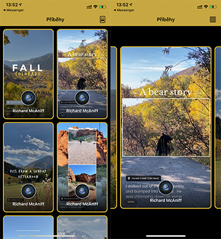

# Nextap Interview Tech Task
> Tech Task project for purposes of interview to senior iOS position.

Application loads stories from given endpoint.
Stories are shown in two column vertical feed style and in horizontal browse style.
I found it interesting to implement requirements as one screen with collection view where feed style is changed just by the Flow Layout.
In this project the main architecture is based on Coordinator pattern. I also used MVVM and Delegate pattern.
As the Dependency Injection library I chose the lightweight project Resolver.
The app also contains simple asynchronous Unit test.

## Requirements

- iOS 13.0+
- Xcode 12

## Installation

Please use the CocoaPods to install the Resolver library.
Launch the project via the nextap-jelinek.xcworkspace

